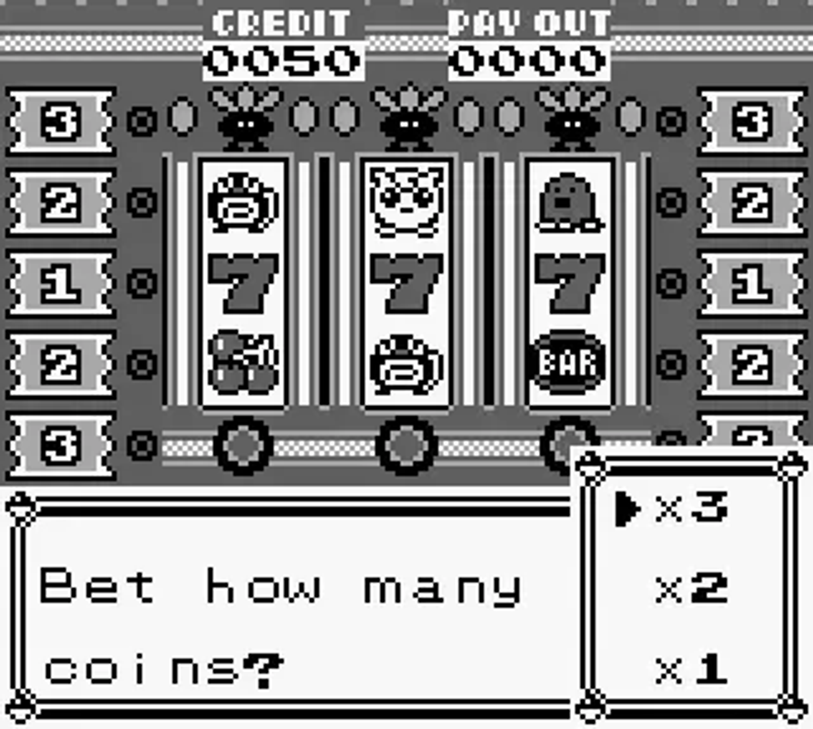

# Exercice Java

## Machine à sous du Casino de Céladopole

### Fonctionnalités

- Les utilisateurs peuvent s'identifier
- Lecture et écriture dans un fichier data.json contenant la configuration (symboles et gains) avec les sauvegardes des joueurs, ainsi que des compteurs de jeux gagnants par symbole.
- Possibilité de lancer une série de tests et voir ses résultats ainsi que les statistiques en %.

### Notions évaluées

- Utiliser une librairie Maven
- Faire un programme en ligne de commande
- Lire et écrire dans un fichier
- La sérialisation et la deserialization
