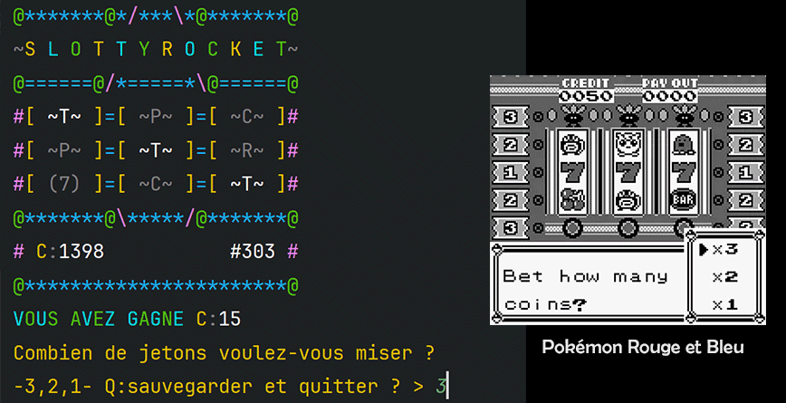

# Evaluation Java

## Machine à sous du Casino de Céladopole

Pokémon Rouge et Bleu

### Notions évaluées

- Utiliser une librairie Maven
- Faire un programme en ligne de commande
- Lire et écrire dans un fichier
- La sérialisation et la deserialization
